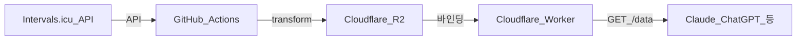

# intervals-coach

Intervals.icu의 훈련 데이터를 **GitHub Actions**로 주기적으로 가져와 **Cloudflare R2**에 올리고, **Cloudflare Worker**가 `GET /data`로 LLM·코칭 에이전트가 읽기 쉬운 JSON을 제공하는 템플릿이다.

**먼저 읽기**

- [이 템플릿에 맞는 사람 / 한계](docs/ELIGIBILITY.md)
- [시스템 워크플로(다이어그램)](docs/WORKFLOW.md)
- [지식기반](docs/knowledge/README.md)
- Claude Code·Cursor 등: [AGENTS.md](AGENTS.md) (커밋 금지 경로·디렉터리 요약)

---

## 시스템 워크플로



Worker는 R2의 `summary.txt`, `wellness.txt`, `activities.txt`, `events.txt`를 JSON으로 묶어 돌려준다. `prompt.txt`는 같은 버킷에 올리되, **별도 공개 URL**로 두고 LLM이 두 번째로 fetch하는 패턴을 권장한다(아래 [LLM 프로젝트 지침](#llm-프로젝트-지침-예시)).

---

## 이 템플릿을 쓰는 이유 / 누구에게 맞는가

본 템플릿은 **철인·멀티스포츠** 준비를 Intervals에 쌓고, 동일한 데이터 파이프라인으로 **LLM 코칭**을 붙이려는 경우에 맞게 짜여 있다. 러닝만·자전거만 하는 경우에도 동작하지만, **T-pace·FTP·파워미터** 등 데이터 전제에 따라 해석 품질이 달라진다. 자세한 기대·한계는 [docs/ELIGIBILITY.md](docs/ELIGIBILITY.md)를 본다.

---

## 사전 요건 (독자 전제)

- **GitHub 계정**은 있다고 가정한다.
- 아래는 **이 문서를 따라 가입·생성**하면 된다.

### Intervals.icu

1. [Intervals.icu](https://intervals.icu/)에서 계정을 만든다.
2. 설정에서 **API 키**를 발급한다.
3. 본인 **Athlete ID**를 확인한다(프로필 URL 등에서 확인 가능).

### Cloudflare

1. [Cloudflare](https://www.cloudflare.com/) 계정을 만든다.
2. **R2**를 활성화하고 **버킷**을 하나 만든다(이름은 예: `intervals-data` — fork 후 본인 이름으로).
3. R2 **S3 API**용 **Access Key ID / Secret Access Key**를 발급한다.
4. 대시보드에서 **Account ID**를 확인한다.
5. **Workers**에서 Worker를 배포할 준비를 한다(아래 [Worker 배포](#6-cloudflare-worker-배포)).

공식 문서:

- [R2 시작하기](https://developers.cloudflare.com/r2/get-started/)
- [Workers 시작하기](https://developers.cloudflare.com/workers/get-started/guide/)

---

## Fork 후 설정 (지인용)

### 1. GitHub에서 Fork

1. 이 템플릿 저장소 페이지에서 **Fork**를 누른다.
2. **본인 계정** 아래에 fork가 생기면, 그 저장소가 **작업 대상(origin)** 이다.

### 2. origin / upstream (선택)

템플릿 업스트림에 PR을 내보낼 생각이 있다면:

```bash
git remote add upstream https://github.com/UPSTREAM_USER/REPO.git
git fetch upstream
```

일반 사용자는 **fork만** 있어도 된다.

### 3. GitHub Secrets (fork 저장소에만)

**Settings → Secrets and variables → Actions → New repository secret** 에 다음을 등록한다. 이름은 워크플로와 **정확히** 일치해야 한다.

| Secret 이름 | 설명 |
|-------------|------|
| `INTERVALS_API_KEY` | Intervals.icu API 키 |
| `INTERVALS_ATHLETE_ID` | 본인 athlete ID (문자열) |
| `CLOUDFLARE_R2_ACCESS_KEY_ID` | R2 S3 호환 Access Key ID |
| `CLOUDFLARE_R2_SECRET_ACCESS_KEY` | R2 Secret |
| `CLOUDFLARE_ACCOUNT_ID` | Cloudflare Account ID |
| `R2_BUCKET_NAME` | 버킷 이름만 (예: `intervals-data`). `s3://` 접두사 없음 |

**주의:** Secrets는 **절대** 커밋하지 않는다. fork에만 넣는다.

### 4. `worker/wrangler.toml` 수정

[worker/wrangler.toml](worker/wrangler.toml)의 `bucket_name`을 본인 R2 버킷 이름과 맞춘다.

```toml
[[r2_buckets]]
binding = "BUCKET"
bucket_name = "여기에_본인_버킷_이름"
```

### 5. 목표·스케줄 수정 (`scripts/transform_data.js`)

[scripts/transform_data.js](scripts/transform_data.js)의 `goals` / `schedule` 블록을 **본인 값으로 수정**한다. 이 값들은 `summary.txt`의 `[goals]`·`[schedule]` 섹션으로 LLM에 전달된다.

```js
goals: {
  weight_kg: null,        // 예: 70
  ftp_wpkg: null,         // 예: 3.5 (W/kg)
  run_10k_mins: null,     // 예: 50 (분)
  swim_1500m_mins: null,  // 예: 35 (분)
  long_term: 'YOUR_GOAL' // 예: 'triathlon_olympic'
},
schedule: {
  swimming: 'YOUR_SWIM_SCHEDULE', // 예: '화,목 주 2회'
  running: 'YOUR_RUN_SCHEDULE'    // 예: '주 3회'
},
```

### 6. Cloudflare Worker 배포

```bash
cd worker
npm install
npx wrangler login
npx wrangler deploy
```

배포가 끝나면 `https://<worker-name>.<subdomain>.workers.dev` 형태의 URL이 나온다. 이후 **`/data`** 로 GET 요청해 본다.

### 7. 첫 동기화 실행

1. fork 저장소 **Actions** 탭에서 **Sync Intervals.icu Data** 워크플로를 연다.
2. **Run workflow**로 수동 실행한다(템플릿 기본값). 주기 실행(cron)은 GitHub Secrets를 모두 넣은 뒤 [`.github/workflows/intervals-sync.yml`](.github/workflows/intervals-sync.yml)에서 `schedule` 블록 주석을 해제해 옵트인한다.
3. 성공하면 R2에 `wellness.txt`, `activities.txt`, `events.txt`, `summary.txt`, `prompt.txt`가 올라간다.  
   - `data/prompt.txt`가 없으면 워크플로가 [data/prompt.example.txt](data/prompt.example.txt)를 복사해 업로드한다. 개인 코칭 문구는 로컬에서 `data/prompt.txt`를 만들어 두면 그 내용이 우선한다(git에는 커밋하지 않음).

### 8. R2에서 `prompt.txt` 공개 URL (선택)

`prompt.txt`를 LLM이 직접 fetch할 수 있도록 공개 URL을 만들려면 R2 버킷을 퍼블릭으로 노출한다.

1. Cloudflare 대시보드 → **R2** → 해당 버킷 → **Settings** 탭
2. **Public access** 섹션에서 **Allow Access** 활성화
3. 활성화되면 `https://pub-<hash>.r2.dev/<파일명>` 형태의 URL이 생성된다.
4. 커스텀 도메인을 연결하려면 같은 Settings 탭 → **Custom Domains** → 도메인 추가.

공식 문서: [R2 퍼블릭 버킷](https://developers.cloudflare.com/r2/buckets/public-buckets/)

이 URL은 **누구나 GET 할 수 있으면** 비밀·개인정보를 넣지 말 것. 민감하면 Worker 뒤에 인증을 두는 등 별도 설계가 필요하다([보안](#보안프라이버시)).

---

## API: `GET /data`

배포한 Worker의 기본 형태:

```http
GET https://YOUR_WORKER.workers.dev/data
```

응답은 JSON이며 문자열 필드 `summary`, `wellness`, `activities`, `events`를 포함한다. 필드·CSV 컬럼 요약은 [docs/knowledge/overview.md](docs/knowledge/overview.md) 참고.

**CORS:** 브라우저 `Origin`이 ChatGPT 도메인일 때만 허용되도록 Worker에 고정되어 있다. **서버·에이전트 fetch**(Origin 없음)는 허용된다. 다른 웹 오리진에서 브라우저로 직접 호출하려면 [worker/src/index.js](worker/src/index.js)의 `ALLOWED_ORIGINS`를 본인 도메인에 맞게 수정해야 한다.

---

## 로컬 실행

루트에서:

```bash
cp .env.example .env
# .env 파일을 열어 INTERVALS_API_KEY, INTERVALS_ATHLETE_ID 값을 채운다
source .env   # 또는: export INTERVALS_API_KEY="..." INTERVALS_ATHLETE_ID="..."
npm run sync
node scripts/transform_data.js
```

`data/*.txt`가 생성된다. 이 파일들은 **개인 데이터**이므로 git에 올리지 않는다(`.gitignore`).

Worker만 로컬에서:

```bash
cd worker
npm install
npm run dev
```

---

## LLM 프로젝트 지침 (예시)

Claude 프로젝트 등에 붙일 때는 **반드시** 본인 URL로 바꾼다.

- `https://YOUR_WORKER.workers.dev/data` — 훈련 JSON
- `https://YOUR_PUBLIC_PROMPT_URL/prompt.txt` — 코칭 가이드 (R2 퍼블릭 등)

전체 예시 본문은 [data/prompt.example.txt](data/prompt.example.txt)를 복사해 수정한다. 분석 시 용어·이론은 [docs/knowledge/](docs/knowledge/README.md)를 따르도록 적어 두는 것을 권장한다.

---

## 보안·프라이버시

- `data/*.txt`·JSON 원본은 **훈련·건강 정보**다. 저장소에 커밋하지 않는다.
- Intervals API 키는 **GitHub Secrets**에만 둔다.
- R2 퍼블릭 URL로 `prompt.txt`를 두면 URL을 아는 사람은 내용을 가져갈 수 있다. 민감한 문구는 넣지 않거나, Worker 뒤에서만 서빙·인증을 검토한다.

---

## 트러블슈팅

| 증상 | 확인할 것 |
|------|-----------|
| Actions가 Intervals에서 실패 | `INTERVALS_API_KEY`, `INTERVALS_ATHLETE_ID` 오타, API 키 만료 |
| R2 업로드 실패 | R2 키·Account ID·버킷 이름, `aws s3 cp`용 endpoint (`https://<ACCOUNT_ID>.r2.cloudflarestorage.com`) |
| Worker 500 / 빈 데이터 | R2에 파일이 올라왔는지, `wrangler.toml`의 `bucket_name`이 실제 버킷과 일치하는지 |
| Worker 403 (브라우저) | CORS 허용 도메인이 ChatGPT 위주로 제한됨 — 에이전트 서버 fetch는 Origin 없이 동작 |
| `/data`에 `prompt` 없음 | 설계상 Worker는 네 필드만 반환. `prompt.txt`는 별도 URL로 fetch |

더 많은 다이어그램: [docs/WORKFLOW.md](docs/WORKFLOW.md)

---

## 별도 경로에서 빈 repo로 시작하기

Fork 대신 파일만 복사해 새 repo를 만들 때는 [docs/HANDOFF.md](docs/HANDOFF.md)를 본다.

---

## 라이선스

[LICENSE](LICENSE) (ISC)

---

## 문서 목차

| 경로 | 내용 |
|------|------|
| [AGENTS.md](AGENTS.md) | AI 코딩 도구용: 금지 커밋·디렉터리 요약 |
| [docs/WORKFLOW.md](docs/WORKFLOW.md) | 파이프라인·Fork·Actions·LLM 순서도 (Mermaid) |
| [docs/ELIGIBILITY.md](docs/ELIGIBILITY.md) | 적합/한계·단일 종목·장비 |
| [docs/HANDOFF.md](docs/HANDOFF.md) | 빈 repo로 수동 복사할 때 |
| [docs/knowledge/](docs/knowledge/README.md) | CTL/ATL, 종목별, 이론·참고문헌 |
