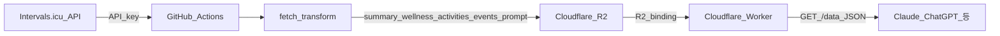
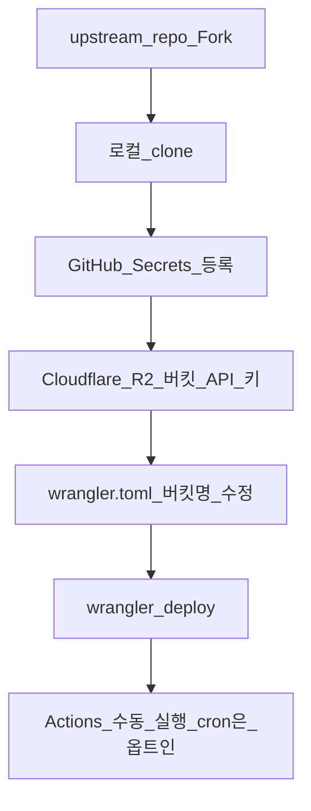
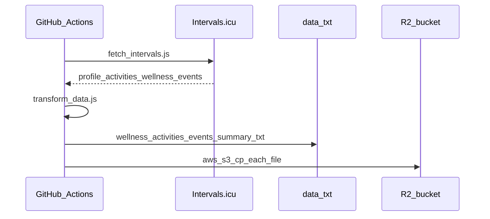
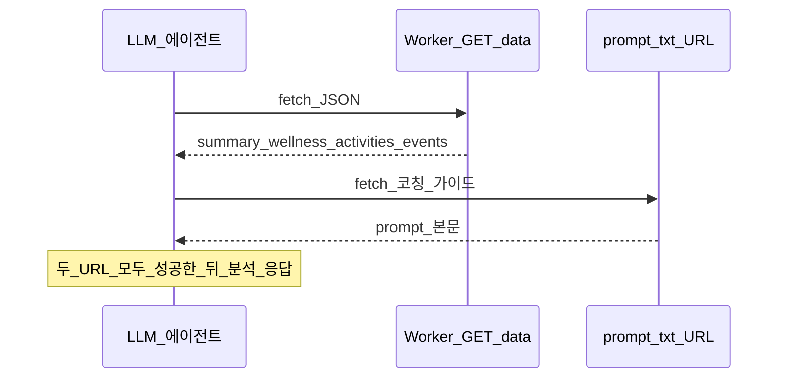
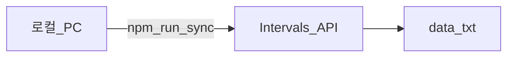

# 시스템 워크플로 (다이어그램)

텍스트로 길게 설명하기보다 흐름을 그림으로 먼저 잡는다. GitHub에서 Mermaid가 렌더링된다.

## 1. 데이터 파이프라인 (Intervals → R2 → Worker)

## 2. Fork 이후 첫 설정 순서

**주의:** GitHub Secrets는 **본인 fork 저장소**에 넣는다. upstream 템플릿 repo에는 비밀을 커밋하지 않는다.

## 3. GitHub Actions 한 번의 실행 안에서

## 4. LLM이 데이터를 읽는 순서 (권장)

## 5. 로컬에서만 동기화할 때 (선택)

CI 없이 `npm run sync`만 실행하면 `data/*.txt`가 로컬에만 생긴다. R2 업로드는 Actions와 동일하게 AWS CLI `aws s3 cp`로 수동 수행하거나, 워크플로를 `workflow_dispatch`로 돌린다. 주기 실행이 필요하면 Secrets 등록 후 `.github/workflows/intervals-sync.yml`의 `schedule`을 옵트인한다.

---

더 읽을 것: [README.md](../README.md), [ELIGIBILITY.md](ELIGIBILITY.md), [knowledge/README.md](knowledge/README.md)
